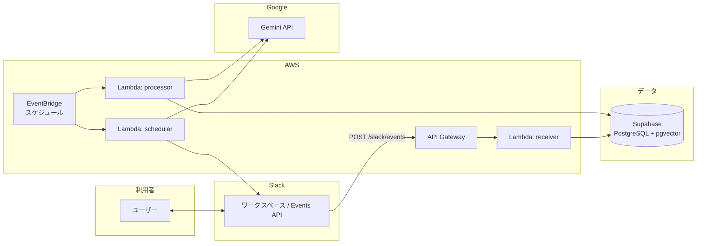
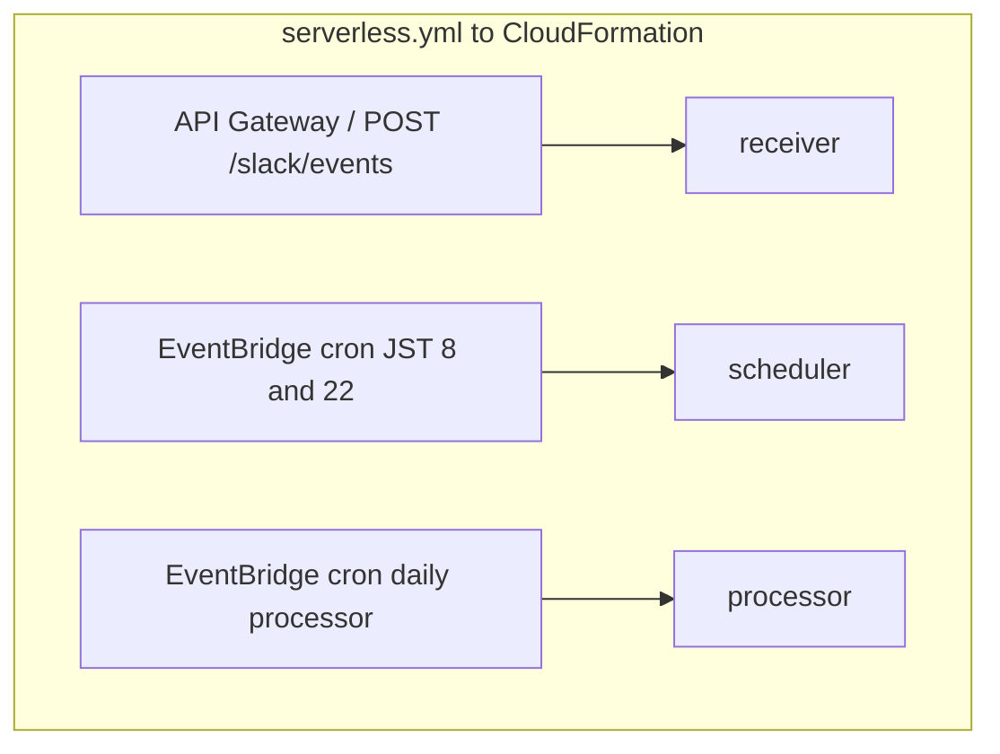
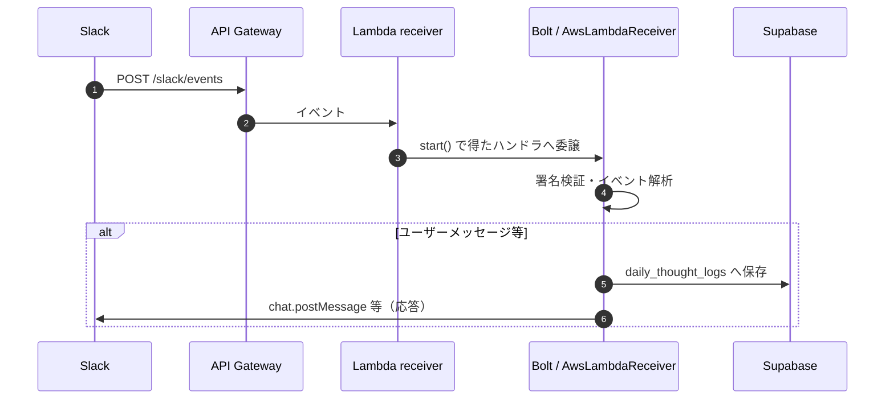
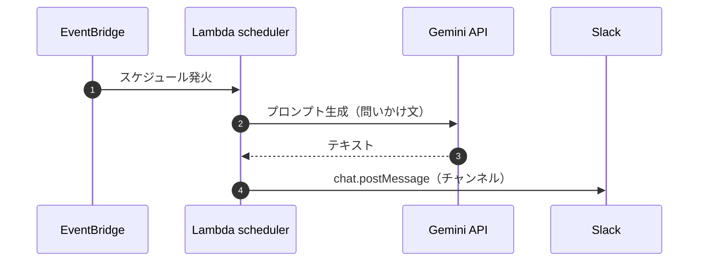
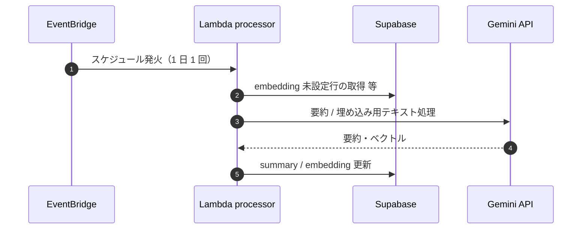
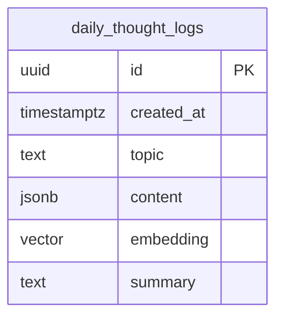
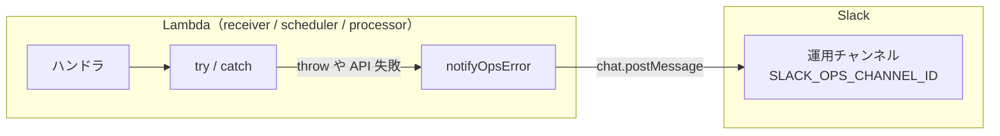
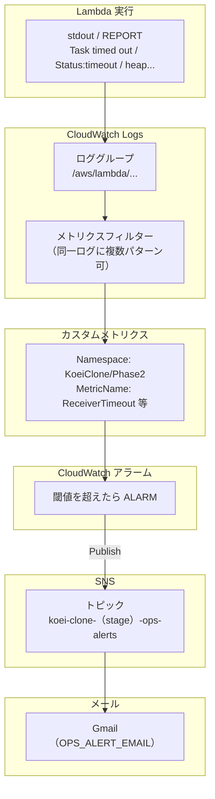
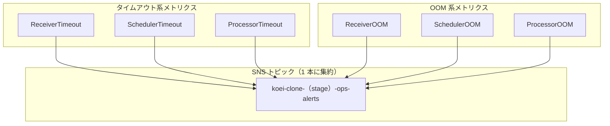

# アーキテクチャ

ライフログ蓄積システム（Slack 対話 → Supabase 保存、定時プロンプト、後処理バッチ）の構成をまとめる。

## システム・コンテキスト

## AWS 上のコンポーネント（デプロイ単位）

Serverless Framework が **API Gateway（REST）**、**Lambda**、**EventBridge ルール** などをまとめてデプロイする。関数名とエントリポイントは `serverless.yml` が正。

## シーケンス: Slack メッセージ受信（receiver）

Slack は Events API で HTTP POST する。Bolt（`AwsLambdaReceiver`）が署名検証とルーティングを行い、ハンドラ内で Supabase へ保存する（実装はスケルトン含む）。

## シーケンス: 定時の問いかけ（scheduler）

EventBridge のスケジュールで Lambda が起動し、Gemini で問い文を生成してから Slack に投稿する。

## シーケンス: 後処理バッチ（processor）

`serverless.yml` で **1 日 1 回**起動し、`embedding` が null の行を **最大 10 件**ずつ要約・ベクトル付与する。

## データストア（Supabase）

会話は `daily_thought_logs` に JSONB（`messages` 配列）として蓄え、将来のファインチューニングや RAG 用に `summary` と `embedding`（pgvector）を載せる想定。

必要に応じて `metadata`（jsonb）などを追加し、セッション ID・品質フラグ・Slack の `thread_ts` 等を載せると運用しやすい。

## 環境変数（Lambda 共通）

| 変数 | 用途 |
|------|------|
| `SLACK_SIGNING_SECRET` / `SLACK_BOT_TOKEN` | Slack 署名検証・API 呼び出し |
| `GEMINI_API_KEY` | Gemini（問い生成・要約・埋め込み） |
| `SUPABASE_URL` / `SUPABASE_SERVICE_ROLE_KEY` | Supabase へのサーバーサイドアクセス |
| `SLACK_DAILY_CHANNEL_ID` | 定時投稿先 (プライベートチャンネルのチャンネル ID) |
| `SLACK_OPS_CHANNEL_ID` | 運用保守先 (プライベートチャンネルのチャンネル ID) |
| `OPS_ALERT_EMAIL` | （任意）第二段階: タイムアウト・OOM の CloudWatch アラームを SNS 経由で受け取る Gmail。`serverless.cloudwatch.yml` で定義 |

## エラーハンドリング

アプリ内で拾える失敗は **Slack 運用チャンネル**、Lambda の外側でしか拾えない失敗（タイムアウト・OOM など）は **Gmail（SNS）** に分ける。

### 第一段階: アプリ内 → Slack 運用チャンネル

各 Lambda の `try/catch`（またはエラー分岐）から **`notifyOpsError`** を呼び、運用保守用の Slack チャンネルにエラーメッセージを送信する。Gemini / Supabase / Slack API の失敗など、**処理の途中まで到達した例外**を主に想定する。

**届きにくい例（第一段階だけでは足りない）**

- **タイムアウト** … 実行が打ち切られ、`notifyOpsError` まで到達しないことがある。
- **OOM** … プロセスが落ちるため同様。

### 第二段階: CloudWatch Logs → メトリクス → アラーム → SNS → Gmail

Lambda の標準ログを **メトリクスフィルター**が監視し、**タイムアウト**と **OOM 疑い**の文字列でカスタムメトリクスを増やす。**CloudWatch アラーム**がしきい値を超えたら **SNS トピック**へ publish し、**メールサブスク**先の **Gmail** に届く仕組み。

**6 本のアラーム**（関数 × 種別）のイメージ:

**検知パターン（例）**

| 種別 | ログ側の目安 |
|------|----------------|
| タイムアウト | JSON の `Task timed out` 相当、または `REPORT` 行の `Status: timeout`（フィルターは両系に対応） |
| OOM 疑い | `heap out of memory` 等 |