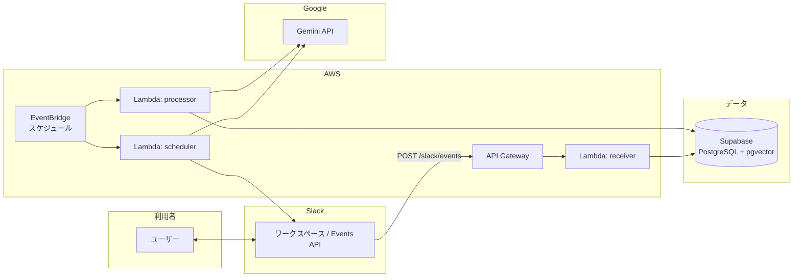
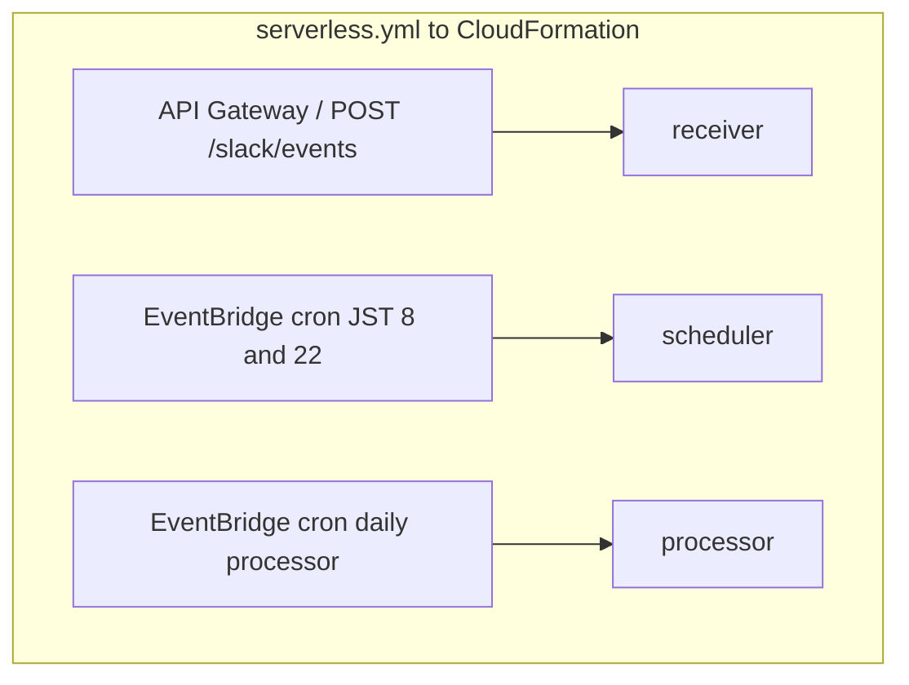
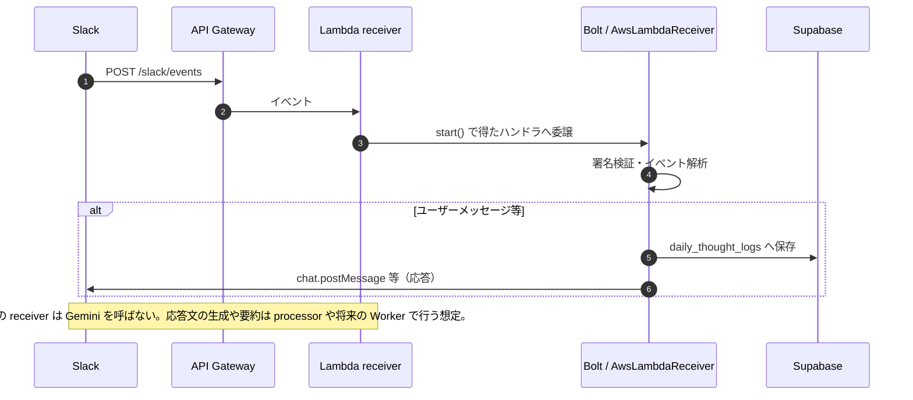
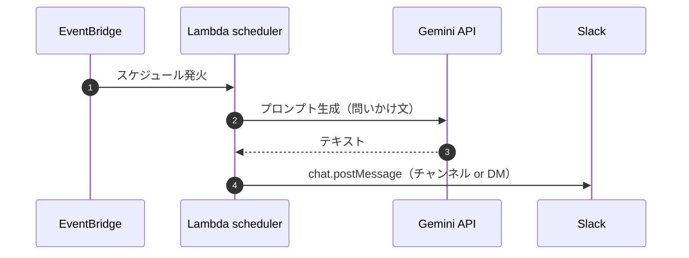
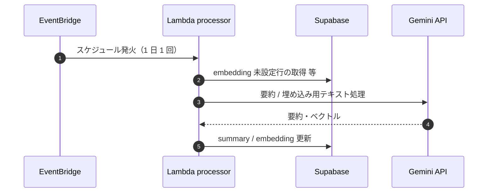
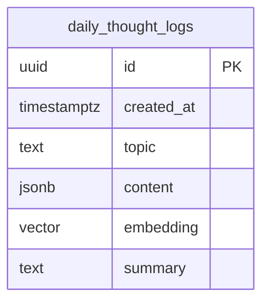

# アーキテクチャ

ライフログ蓄積システム（Slack 対話 → Supabase 保存、定時プロンプト、後処理バッチ）の構成をまとめる。

## システム・コンテキスト

## AWS 上のコンポーネント（デプロイ単位）

Serverless Framework が **API Gateway（REST）**、**Lambda**、**EventBridge ルール** などをまとめてデプロイする。関数名とエントリポイントは `serverless.yml` が正。

（`subgraph` タイトルやラベルに **`→`（U+2192）を入れると**、環境によっては矢印トークンと衝突して **syntax error** になります。` ` や `...` もレンダラによっては不安定なので、上記のように **ASCII とスラッシュ区切り**にしています。）

## シーケンス: Slack メッセージ受信（receiver）

Slack は Events API で HTTP POST する。Bolt（`AwsLambdaReceiver`）が署名検証とルーティングを行い、ハンドラ内で Supabase へ保存する（実装はスケルトン含む）。

## シーケンス: 定時の問いかけ（scheduler）

EventBridge のスケジュールで Lambda が起動し、Gemini で問い文を生成してから Slack に投稿する。

## シーケンス: 後処理バッチ（processor）

`serverless.yml` で **1 日 1 回**起動し、`embedding` が null の行を **最大 10 件**ずつ要約・ベクトル付与する。

## データストア（Supabase）

会話は `daily_thought_logs` に JSONB（`messages` 配列）として蓄え、将来のファインチューニングや RAG 用に `summary` と `embedding`（pgvector）を載せる想定。

必要に応じて `metadata`（jsonb）などを追加し、セッション ID・品質フラグ・Slack の `thread_ts` 等を載せると運用しやすい。

## 環境変数（Lambda 共通）

| 変数 | 用途 |
|------|------|
| `SLACK_SIGNING_SECRET` / `SLACK_BOT_TOKEN` | Slack 署名検証・API 呼び出し |
| `GEMINI_API_KEY` | Gemini（問い生成・要約・埋め込み） |
| `SUPABASE_URL` / `SUPABASE_SERVICE_ROLE_KEY` | Supabase へのサーバーサイドアクセス |
| `DAILY_PROMPT_TARGET_ID` | 定時投稿先（チャンネル ID またはユーザー ID） |
| `DAILY_PROMPT_USE_DM` | DM かチャンネルかの切り替え用（実装側で解釈） |

## 補足: 将来の拡張

- **Receiver を即応答専用にし、重い処理を別 Lambda（Worker）へ非同期 Invoke**すると、Slack の 3 秒制限と負荷分散に有利（`docs/core-image.md` の構成に近づく）。
- **埋め込み次元**は利用モデル（例: 768 / 1536）と `vector(n)` を一致させること。
