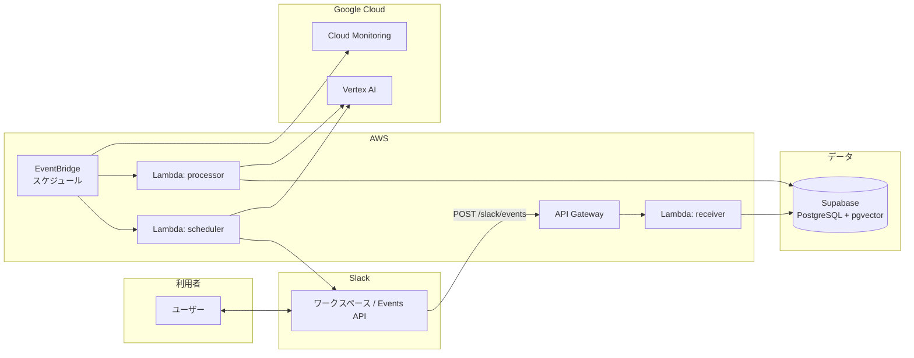

<div id="top"></div>

## 使用技術一覧

<p style="display: inline">
  
  
  
  
  
  
  
</p>

## 目次

1. [プロジェクトについて](#プロジェクトについて)
2. [環境](#環境)
3. [ディレクトリ構成](#ディレクトリ構成)
4. [開発環境構築](#開発環境構築)
5. [トラブルシューティング](#トラブルシューティング)

<br />
<div align="right">
    <a href="ARCHITECTURE.md"><strong>アーキテクチャ »</strong></a>
</div>
<div align="right">
    <a href="docs/cost.md"><strong>コスト見積もり »</strong></a>
</div>
<div align="right">
    <a href="docs/task.md"><strong>タスク一覧 »</strong></a>
</div>
<br />

## プロジェクト名

koei-clone

## 概要

Slack での対話を **Supabase（PostgreSQL + pgvector）** に蓄積し、将来の **ファインチューニング** や **RAG** に使える形式で保存するための **サーバーレス** バックエンドです。生成と埋め込みは **Vertex AI** を使い、利用状況は **Cloud Monitoring** から集計して Slack に通知します。

**AWS Lambda**（Serverless Framework v3）で以下を実行します。

- **receiver**: Slack Events API（メッセージ受信・保存）
- **scheduler**: 定時の問いかけ（属性付きテンプレート + Vertex AI で文面生成 → Slack 投稿）
- **processor**: 要約・埋め込みベクトル付与（**1 日 1 回**・未処理最大 10 件/回）
- **opsReporter**: Cloud Monitoring から Vertex AI 利用状況を集計し、運用保守チャンネルへ定期投稿

詳細は [ARCHITECTURE.md](ARCHITECTURE.md) を参照してください。

<p align="right">(<a href="#top">トップへ</a>)</p>

## 全体像



## 環境

| 言語・フレームワーク | バージョン（目安） |
| ---------------------- | ------------------ |
| Node.js                | 22.x　　　　　　　　　|
| TypeScript             | 5.7.x              |
| Serverless Framework   | 3.40.x             |

その他の依存パッケージは [package.json](package.json) と [package-lock.json](package-lock.json) を参照してください。

<p align="right">(<a href="#top">トップへ</a>)</p>

## ディレクトリ構成

``` 
.
├── ARCHITECTURE.md
├── README.md
├── README_TEMPLATE.md
├── .env.example
├── serverless.cloudwatch.yml
├── serverless.yml
├── package.json
├── package-lock.json
├── tsconfig.json
├── docs
│   ├── core-image.md
│   ├── cost.md
│   ├── input.md
│   └── task.md
├── sql
│   ├── 001_create_daily_thought_logs.sql
│   └── 002_add_slack_event_id.sql
└── src
    ├── handlers
    │   ├── opsReporter.ts
    │   ├── processor.ts
    │   ├── receiver.ts
    │   └── scheduler.ts
    └── lib
        ├── gemini.ts
        ├── googleCloud.ts
        ├── googleMonitoring.ts
        ├── opsAlert.ts
        ├── promptCatalog.ts
        ├── slack.ts
        └── supabase.ts
```

<p align="right">(<a href="#top">トップへ</a>)</p>

## 開発環境構築

### 前提

- Node.js 22 以上（AWS Lambda の実行環境は **22.x** / `nodejs22.x`）
- AWS アカウントへデプロイする場合: AWS CLI の設定、および Serverless Framework の利用可能な認証情報
- Slack アプリ、Supabase プロジェクト、Google Cloud プロジェクト（Vertex AI と Cloud Monitoring を有効化）

### Slack

- Basic Information: 
    - Signing Secret の取得
- Install Apps:
    - Bot User Oauth Token の取得
- OAuth & Permissions:
    - ボットトークンのスコープ設定: `chat:write`, `groups:history`
- Event Subscriptions:
    - Request URL に API Gateway の URL を入れる
    - Subscribe to bot events: `message.groups`
- Slack チャンネル:
    - URL 後半から投稿先のチャンネル ID を取得 (ex. https://example.com/archives/XXXXXXXXXXX → XXXXXXXXXXX) 
    - 運用保守チャンネル ID を取得

### Supabase

1. SQL Editor で [sql/001_create_daily_thought_logs.sql](/Users/yoshikoei98/Documents/koei-clone/sql/001_create_daily_thought_logs.sql) を実行
2. 続けて [sql/002_add_slack_event_id.sql](/Users/yoshikoei98/Documents/koei-clone/sql/002_add_slack_event_id.sql) を実行

- Project Settings: 
    - Data API → API URL を取得
    - API Keys → service role key を取得

### Google Cloud / Vertex AI

- Google Cloud プロジェクトを作成
- `Vertex AI API` と `Cloud Monitoring API` を有効化
- Vertex AI 呼び出しと Monitoring 閲覧ができるサービスアカウントを作成
- サービスアカウントキー JSON を取得し、`GCP_SERVICE_ACCOUNT_JSON` に 1 行 JSON として設定
- `GCP_PROJECT_ID` と `VERTEX_AI_LOCATION` を控える

### パッケージインストール

```bash
npm install
```

### 環境変数の設定

デプロイ前に、シェルまたは CI で [環境変数の一覧](#環境変数の一覧) を設定してください。`serverless.yml` は `${env:変数名}` 形式で参照します。

### AWS にデプロイ

```bash
# Serverless CLI の serverless deploy と同等
npm run deploy
```

## 環境変数一覧

| 変数名 | 役割 |
| ------ | ---- |
| `SLACK_SIGNING_SECRET` | Slack リクエストの署名検証 |
| `SLACK_BOT_TOKEN` | Slack Web API（投稿など） |
| `GCP_PROJECT_ID` | Vertex AI / Cloud Monitoring を使う Google Cloud プロジェクト ID |
| `GCP_SERVICE_ACCOUNT_JSON` | Vertex AI / Cloud Monitoring 呼び出し用サービスアカウントキー JSON |
| `VERTEX_AI_LOCATION` | Vertex AI のロケーション（例: `us-central1`, `global`） |
| `SUPABASE_URL` | Supabase プロジェクト URL |
| `SUPABASE_SERVICE_ROLE_KEY` | Supabase サーバー側書き込み用キー（サーバーのみで保持） |
| `SLACK_DAILY_CHANNEL_ID` | 定時投稿先 (プライベートチャンネルのチャンネル ID) |
| `SLACK_OPS_CHANNEL_ID` | 運用保守先 (プライベートチャンネルのチャンネル ID) |
| `OPS_ALERT_EMAIL` | 監視エラーの通知先メールアドレス |

## 今後の展望

- Slack スレッド単位で `content.messages` を統合し、問いと応答の往復をより一貫した学習データとして保存する
- `topic` や `metadata` を導入し、Slack の `thread_ts` や品質フラグを保持できるようにする
- ファインチューニング用 / RAG 用にエクスポート形式を整え、どのモデルへどう流すかを決める
- テスト、コスト見積もり、運用ナレッジを整備して本番運用しやすくする
